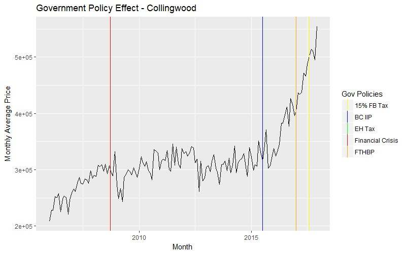
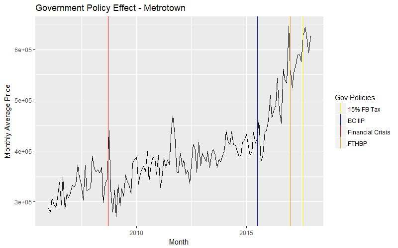
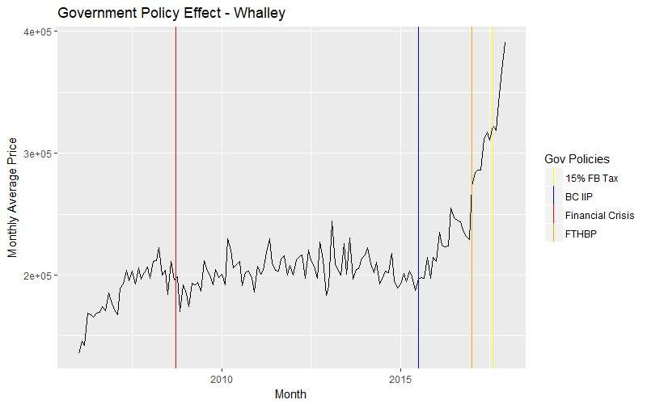
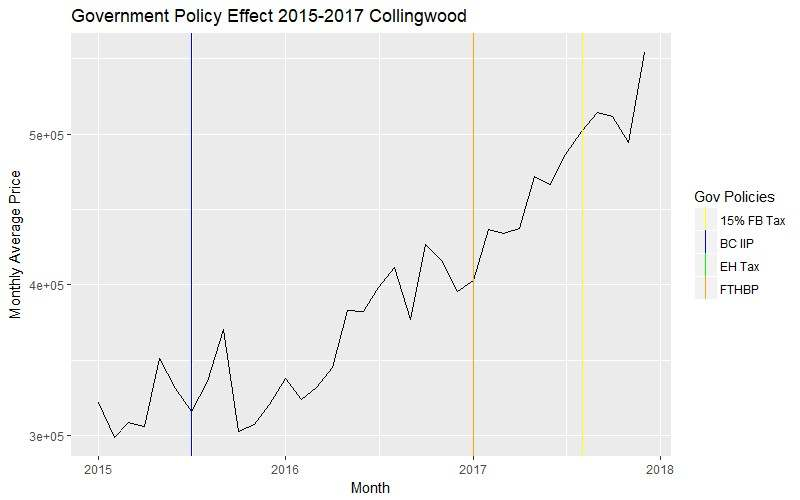
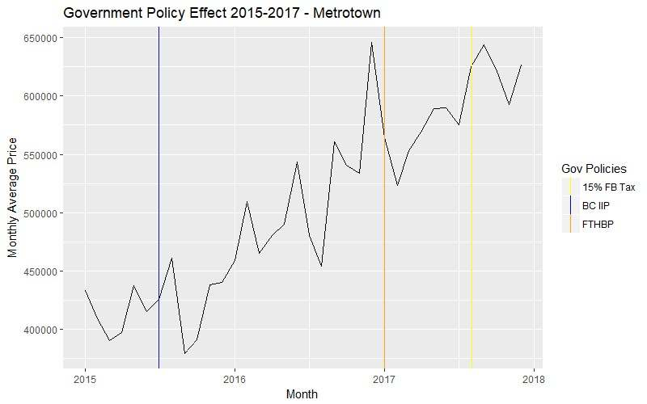
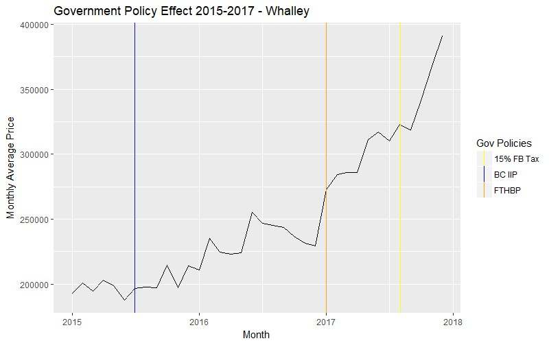

```{r setup, include=FALSE}
knitr::opts_chunk$set(echo = TRUE)
library(knitr)
```

## Summary

The client is a real estate agent in Metro Vancouver who actively buys and sells mainly condo homes for her clients. She is interested in knowing the potential values of condo homes in three neighborhoods: Collingwood, Metrotown, and Whalley. Statistical methods were performed on the data provided to determine patterns in condo price and estimate future condo price per square foot. Exploratory analysis has shown that the introduction of the BC Investment Immigration Program was followed by a large boost in condo price. A forecast using seasonal ARIMA has been fairly accurate for Collingwood and Whalley, but performed inadequately for Metrotown. Random forest, which predicts price based on multiple characteristics associated with a condo, has given us a prediction error of 6.7% for Collingwood, 7.8% for Metrotown, and 7.7% for Whalley. 

## Introduction

Our goal is to predict the monthly resale condo price per square foot in 2018, for each of the following three sub-regions in the Greater Vancouver area: Collingwood, Metrotown and Whalley. We also seek to identify the region with the highest growth potential in terms of price per square foot. Additionally, we aim to predict the potential sales prices of specific condos that our client is buying and selling. To help our client identify the most popular types of properties, we also hope to analyze the potential sales growth of condos of different sizes in 2018. 

Once we have accomplished these goals, we plan to compare our predictions for early 2018 with the currently available market data to determine how well our models perform. Moreover, we would like to see if our predictions turn out to be consistent with those done by Nu Stream Realty and other institutions.

## Data Description

To address these problems, we used sales records on [MLSLink](https://idp.gvfv.clareitysecurity.net). We obtained information on condos in the three aforementioned regions (Collingwood, Metrotown, and Whalley) from January 1st, 2006 to December 31, 2017. There are 2956 listings for Collingwood, 3542 listings for Metrotown, and 5069 listings for Whalley. We selected variables which we believe were relevant to condo price prediction. These selected variables are:
  
- List Date
- Days on Market
- Previous Status
- Strata Maintenance Fee
- Number of Bedrooms
- Number of Bathrooms
- Age
- Locker
- Number of Parking Spaces
- Previous Sold Price
- Total Floor Area
- Bylaw Restrictions (such as pet allowance)

We also collected external data whose characteristics could be associated with condo prices. These include the following:

- Foreign exchange rate (forex.com)
- Government policies, such as the 15% foreign buyer tax implemented in 2016

In our next report, we aim to include more external data, such as past interest rates and school rankings of the regions.

To proceed with our analysis, data cleaning was performed. This involved taking out outliers and other problematic listings in the table, such as abnormally old condos or condos without known sold price. (See Appendix for more details.)

## Methods

### Exploratory Analysis

Before any prediction were to be made on the future of Greater Vancouver's real estate market, it would always be wise to understand key patterns of the past. Hence, we did some exploratory analysis to visualize the main characteristics of our dataset. Since many of the client's buyers and sellers are concerned about age, strata fee, and government policies when buying or selling a property, we plotted price per square foot to these variables. These exploratory plots were also used to help us detect any anomalies within our data, and apply reasonable transformations to our variables.

We used the visualization package "ggplot" from R to create all of our plots.

### ARIMA

Since price per square foot changes over time, we employed a commonly-used statistical method for predicting time series data: the Autoregressive Integrated Moving Average model, also known as ARIMA. This model assisted us in forecasting near-future prices using what we know about the past. The use of this model came with an assumption that the future prices depend on the past trend and seasonality. One limitation of this model is that it only takes into account historical prices, and does not consider the effects of other variables. 

To achieve this prediction, we used the "forecast" library in R. The "auto.arima" method searches through multiple combinations of ARIMA parameters and selects those that optimize the model fit. The method finds the best model by handling seasonality effect and trend in the time series data. 

For each district, the price per square foot data from January 2006 to September 2017 was used to fit the ARIMA model. Then, we used the fitted model to predict the price per square foot from October to December 2017 in order to see how accurately our model predicts. 

### Random Forest

Random forest is a statistics method used to build predictive models for classification or regression models. Unlike an ARIMA model which is fitted based on only the underlying time series data, a random forest model factors in the effects of multiple variables. It does so through the use of ensembling the predictions of multiple decision trees. 

We used a random forest to predict monthly average price per square foot based on the relevant characteristics identified previously in our *Data Description* section. This was done using the library "randomForest" in R. 

To assess the performance of our model, we used a technique called cross-validation. Cross-validation breaks the underlying data into random training and testing sets, and uses the training set to build a model which is assessed with the testing set. This was performed several times on our real estate data with random training and testing sets each time, so that we obtain a measure of the prediction error for our overall random forest model. 

Again unlike our ARIMA prediction, instead of predicting an average market price for condos, our random forest model requires a specific condo with all of the relevant charateristics listed in our variable list (see results section below) in order to predict the price of that specific condo. 


## Results: Exploratory Analysis

```{r explore, echo=FALSE, warning=FALSE, message=FALSE}
library(ggplot2)
#library(rstudioapi)
#setwd(dirname(rstudioapi::getSourceEditorContext()$path))
load("clean_data.RData")
full_data$Sold.Date = full_data$List.Date + full_data$DOM
collingwood <- subset(full_data, Neighborhood == "Collingwood" & !is.na(Sold.Price.per.SqFt))
metrotown <- subset(full_data, Neighborhood == "Metrotown" & !is.na(Sold.Price.per.SqFt))
whalley <- subset(full_data, Neighborhood == "Whalley" & !is.na(Sold.Price.per.SqFt))
```

We first explored the relationship between age and strata fee on the price per square foot of condos. 

```{r age, echo=FALSE, warning=FALSE, message=FALSE}
ggplot(collingwood[collingwood$Age < 60, ], aes(x = Age, y = Sold.Price.per.SqFt)) + geom_point() + geom_smooth(method = "lm") + ylab("Sold Price per Sqft") + ggtitle("Figure 1: Sold Price per Sqft vs Age")
```

This plot shows the price per square foot of condos in Collingwood vs age of the condos. We noticed that in general, newer condos have higher sold price per square foot than older condos, but we needed more variables to explain the behavior of the price. 

```{r strata, echo=FALSE, warning=FALSE, message=FALSE}
ggplot(collingwood, aes(y = Sold.Price.per.SqFt, x = StratMtFee)) + geom_point() + geom_smooth(method = "lm") + xlab("Strata Maintenance Fee") +
  ylab("Sold Price per Sqft") + ggtitle("Figure 2: Sold Price per Sqft vs Strata Maintenance Fee")
```


This plot shows the price per square foot of condos in Collingwood vs strata fee of the condos. Here we noticed that as strata fee increases, price also increases. This was somewhat expected, since buyers are less inclined to pay more per month towards strata fees, and higher fees usually indicate more problems to fix. 


We plotted the prices over time to see what the general trend looked like for Collingwood. 

```{r price, echo=FALSE, warning=FALSE, message=FALSE}
ggplot(collingwood, aes(x = Sold.Date, y = Sold.Price.per.SqFt)) + geom_point() + geom_smooth() + xlab("Sold Date") + ylab("Sold Price per Sqft") +
   ggtitle("Figure 3: Sold Price per Sqft vs Sold Date")
```

Here we noticed that the price per square foot remained steady until around 2015, when the price grew rapidly at an accelerating pace. Between 2006 and 2015, we noticed that there were some dips, one of which occurred in 2009. This was no surprise, since the late-2008 financial crisis caused many asset values to fall around the globe. (See Events and Government Policies section)

We thought that this trend could be explained by the effects of foreign currency and government policies, which we explored next. 

### Foreign Currency

Recently on the news, there were frequently heated discussions about foreign buyers driving up the Vancouver real estate prices. It has been mentioned that most of the foreign buyers were Chinese or American citizens. Due to this, we chose to explore whether the foreign value of the Canadian Dollar had an impact on the price. 

We plotted the value of the Canadian Dollar in terms of the US Dollar and the Chinese Yuan over time:

```{r currency, echo=FALSE, warning=FALSE, message=FALSE}
cad_usd <- read.csv("../STAT450_STAT550_RealEstate/external_data/cad_usd.csv")
cad_cny <- read.csv("../STAT450_STAT550_RealEstate/external_data/cad_cny.csv")

names(cad_usd) = c("Date","CAD_USD")
names(cad_cny) = c("Date","CAD_CNY")
cad_usd$Date = as.Date(as.character(cad_usd$Date), format = "%d-%b-%y")
cad_cny$Date = as.Date(as.character(cad_cny$Date), format = "%d-%b-%y")

cad_usd_daily = data.frame()
cad_cny_daily = data.frame()
curDate = as.Date("2005-07-01")
i = 1
while (curDate <= as.Date("2017-12-31") && i <= nrow(cad_usd)) {
  if (abs(curDate - cad_usd[i,1]) <= 30) {
    cad_usd_daily = rbind(cad_usd_daily, c(curDate,cad_usd[i,2]))
    cad_cny_daily = rbind(cad_cny_daily, c(curDate,cad_cny[i,2]))
    curDate = curDate + 1
  } else {
    i = i+1
  }
}
names(cad_usd_daily) = c("Date", "CAD_USD_DAILY")
names(cad_cny_daily) = c("Date", "CAD_CNY_DAILY")
cad_usd_daily$Date = as.Date(cad_usd_daily$Date, origin = "1970-01-01")
cad_cny_daily$Date = as.Date(cad_cny_daily$Date, origin = "1970-01-01")

collingwood_currency = merge(collingwood, cad_usd_daily, by.x = "List.Date", by.y = "Date")
collingwood_currency = merge(collingwood_currency, cad_cny_daily, by.x = "List.Date", by.y = "Date")

ggplot(cad_usd_daily, aes(x = Date, y = CAD_USD_DAILY)) + geom_line() + ylab("USD per CAD") + ggtitle("Figure 4: CAD to USD vs Date")
ggplot(cad_cny_daily, aes(x = Date, y = CAD_CNY_DAILY)) + geom_line() + ylab("CNY per CAD") + ggtitle("Figure 5: CAD to CNY vs Date")

```

Here we noticed that, after 2013, the Canadian Dollar started to steadily fall with respect to both the USD and the CNY until 2016 when it hit a 10-year low. We saw the most pronounced drop in CAD at the beginning of 2015 in both plots, when the value of CAD fell beneath its previous low in 2009. This time was also exactly when the condo prices started to grow at an exponential pace. Thus, it would be reasonable to suspect that currency plays an important role in condo price movement. 


We also looked at the extent of the effect of foreign exchange rate on price. To do this, we expressed the price per square foot in terms of USD and CNY, and plotted them over time. If the plots were more or less linear, then currency's impact would have been among the greatest. If there were still sudden peaks and dips having taken currency into account, then there would have been other equally if not more influential variables we need to consider. 


```{r combinedcurrency, echo=FALSE, warning=FALSE, message=FALSE}
ggplot(collingwood_currency, aes(x = Sold.Date, y = Sold.Price.per.SqFt*CAD_USD_DAILY)) +
  geom_point() + geom_smooth() + ylab("Sold Price per Sqft in USD")+ xlab("Sold Date") + ggtitle("Figure 6: Sold Price per Sqft (USD) vs Date")
ggplot(collingwood_currency, aes(x = Sold.Date, y = Sold.Price.per.SqFt*CAD_CNY_DAILY)) + 
  geom_point() + geom_smooth() + ylab("Sold Price per Sqft in CNY")+ xlab("Sold Date") + ggtitle("Figure 7: Sold Price per Sqft (CNY) vs Date")
```


In both of these plots we noticed that, in terms of foreign currency, the growth in price was still pronounced starting in 2015. Clearly, there must have been other factors contributing to this rapid increase of housing price. 


### Events and Government Policies

It is without doubt that economic events and government policies could help shift the real estate market in a certain direction. The client was interested in knowing how much the upcoming policies, such as the 20% foreign buyer tax and the province-wide home vacancy tax, could affect the condo prices. To do this, we explored the impact that past policies and events had on price. 

The events we looked at are:

- Financial Crisis, September 2018
- BC Investment Immigration Program (BC IIP), July 2015
- First Time Home Buyer's Program (FTHBP), January 2017
- Empty Homes Tax (EH Tax), January 2017 (City of Vancouver only)
- 15% Foreign Buyer Tax (15% FB Tax), August 2017

\pagebreak

Figure 8: Collingwood Events and Policies

\

Figure 9: Metrotown Events and Policies

\

\pagebreak

Figure 10: Whalley Events and Policies

\

Each of the three plots showed that there was a slight dip in the condo price after the late-2008 recession. We noticed that most of the growth in condo price came later on in 2015. Furthermore, it was stunning to see that the BC Investment Immigration Program preceeded the rapid growth in price in all three plots. Let us plot the prices for just 2015 and afterwards.

\pagebreak

Figure 11: Collingwood Events and Policies (post-2015)

\

Figure 12: Metrotown Events and Policies (post-2015)

\

\pagebreak

Figure 13: Whalley Events and Policies (post-2015)

\


Note that the usual processing time for immigration is around 2 to 3 months. If we were to drag ahead our vertical blue line (representing the start of the program) by 3 months, it would lie on the starting point of the rapid price growth. Since it was apparent that the growth started at the same time the first batch of investment immigrants were approved, we concluded that the BC Investor Immigration Program was a large catalyst behind condo price movement. 

Due to poor housing affordability, the municipal and provincial governments have come up with some policies trying to address this issue. During the past two years, they have implemented "First Time Home Buyers' Program", "Empty Homes Tax" in Vancouver, and the "15% Foreign Buyer Tax". From these plots, it was hard to see the extent of affordability improved by these policies. In fact, it seemed that these policies did not have any effect at all in controlling condo price. With that in mind, we doubt that the new 20% Foreign Buyer Tax and the province-wide home vacancy tax would have an evident effect on controlling future condo price. 

## Results: ARIMA

```{r arima, message=FALSE, warning=FALSE, echo=FALSE}
#library('lubridate')
library('ggplot2')
library('tseries')
library('forecast')
library(lubridate)
load("clean_data.RData")
date <- as.Date(full_data$List.Date, "%m/%d/%Y") 
sold_date <- format(date + full_data$DOM,format = "%Y/%m")
full_data <- cbind(full_data, sold_date)

collingwood <- subset(full_data, Neighborhood == "Collingwood")
metrotown <-subset(full_data, Neighborhood == "Metrotown")
whalley <-subset(full_data, Neighborhood == "Whalley")
c_sold_price <- aggregate(collingwood$Sold.Price.per.SqFt, list(collingwood$sold_date), mean)
m_sold_price <- aggregate(metrotown$Sold.Price.per.SqFt, list(metrotown$sold_date), mean)
w_sold_price <- aggregate(whalley$Sold.Price.per.SqFt, list(whalley$sold_date), mean)

names(c_sold_price) <- c("date","price")
names(m_sold_price) <- c("date","price")
names(w_sold_price) <- c("date","price")

make_plots <- function(sold_price, title){
  # make a time series object
  na = which(is.na(sold_price$price))
  sold_price$price[na] = mean(c(sold_price$price[na-1], sold_price$price[na+1]))
  ma = ts(na.omit(sold_price$price), frequency=12)
  # decomposition of data into seasonal effect, trend, and error
  decomp = stl(ma, s.window="periodic")
  # use auto.arima to find the best set of parameters for ARIMA based on AIC and make 3 predictions
  # Note: FOR ARIMA shorter windows increase your parameter risk while longer windows increase your model risk  
  train = auto.arima(ma[-c(142:144)], D=1)
  prediction <- forecast(train,h=3)
  plot(prediction, main=title, xlab = "Year", ylab = "Monthly Mean Price per Sqft", xaxt="n")
  axis(1, at = seq(1, 156, 12), labels= format(seq(from=as.Date('2006-01-15'), to=as.Date('2018-12-15'), length.out = 13), "%Y"))
  lines(ts(ma))

  return(data.frame(Month = c("October 2017", "November 2017", "December 2017"), 
                    Pred.Mean = prediction$mean, 
                    Pred.Lower = prediction$lower, 
                    Pred.Upper = prediction$upper, 
                    Actual = ma[142:144]))
}
```

We employed the ARIMA method on the Collingwood, Metrotown, and Whalley condo prices. We used monthly mean price per square foot from January 2006 to September 2017 to train our ARIMA model. To assess the accuracy of our prediction, we compared our prediction to the actual monthly mean price per square foot from October 2017 to December 2017.

```{r collingwood_arima, echo=FALSE, warning=FALSE}
col_arima <- make_plots(c_sold_price, "Figure 14: ARIMA Forecasting of Collingwood Monthly Mean Price")
kable(col_arima, caption = "ARIMA Forecasting of Collingwood Monthly Mean Price")
```

```{r metrotown_arima, echo=FALSE, warning=FALSE}
met_arima <- make_plots(m_sold_price, "Figure 15: ARIMA Forecasting of Metrotown Monthly Mean Price")
kable(met_arima, caption = "ARIMA Forecasting of Metrotown Monthly Mean Price")
```

```{r whalley_arima, echo=FALSE, warning=FALSE}
wha_arima <- make_plots(w_sold_price, "Figure 16: ARIMA Forecasting of Whalley Monthly Mean Price")
kable(wha_arima, caption = "ARIMA Forecasting of Whalley Monthly Mean Price")
```

The blue line in the above three figures (Figures 14 to 16) represents the mean of the prediction generated by the fitted ARIMA models. The black line represents the actual observed values. The dark grey shaded region represents the 80% confidence interval (we are 80% confident that the actual mean price should be in that interval), and the light grey shaded region represents the 95% confidence interval. 

Here, we see that for Collingwood, our predictions for the monthly mean price are lower than the actual values in October to December. However, the actual values are somewhat captured by our 80% and 95% confidence intervals, with higher accuracy in October and November than in December. For Metrotown, our model did not perform well, since for both October and December, our 80% confidence interval did not capture the actual values. For Whalley, our performance was similar to Collingwood's, with October being accurately captured by the 80% confidence interval, November being less accurate and December being the least accurate. 

Since one considerable limitation of ARIMA is that it does not consider the effects of other variables, we also tried to predict these prices using random forest.

## Results: Random Forest

We supplied variables that could be related to condo prices in order to build a random forest model. We excluded variables that we think were irrelevant for prediction, such as agent name and MLS number. The remaining variables that were considered in the model are:

- Days on Market
- Strata Maintenance Fee
- Number of Bedrooms
- Number of Bathrooms
- Age
- Locker
- Number of Parking Spaces
- Previous Sold Price / Status
- Sold Year
- Sold Month
- Total Floor Area
- Bylaw Restrictions (such as pet allowance)


```{r random_forest_data, echo=FALSE, warning=FALSE, message=FALSE}
options(warn = 0)
##library("lubridate")
load("clean_data.RData")

full_data$Sold.Date <- full_data$List.Date + full_data$DOM
full_data$SoldYear <- as.numeric(format(full_data$Sold.Date,"%Y"))
full_data$SoldMonth <- as.numeric(format(full_data$Sold.Date,"%m"))

#may need to change the following condition
outlier <- which(full_data$Age >= 999 | is.na(full_data$Price) | is.na(full_data$Sold.Price.per.SqFt) | is.na(full_data$DOM))
full_data <- full_data[-outlier,]

#may need to consider including/excluding other columns such as List.Date
subset_data <- subset(full_data, select=-c(S.A, PicCount, Pics, ML.., Status, Address, List.Date, Sold.Date, TypeDwel, List.Sales.Rep.1...Agent.Full.Name, Age.Type))

# replace NA parking with -1 (treat as separate category)
subset_data$TotalPrkng <- replace(subset_data$TotalPrkng, is.na(subset_data$TotalPrkng), -1)

# deal with non prev sold properties
subset_data$Prev.Price <- replace(subset_data$Prev.Price, is.na(subset_data$Prev.Price), 0)
subset_data$Prev.Sold <- subset_data$Prev.Price != 0

# deal with NA strata maintenance fees
subset_data$StratMtFee <- replace(subset_data$StratMtFee, is.na(subset_data$StratMtFee), 0)

subset_data$Tot.BR <- as.factor(subset_data$Tot.BR)
subset_data$Tot.Baths <- as.factor(subset_data$Tot.Baths)
subset_data$TotalPrkng <- as.factor(subset_data$TotalPrkng)
subset_data$Neighborhood <- as.factor(subset_data$Neighborhood)

subset_data$Age <- as.numeric(subset_data$Age)
subset_data$Prev.Sold <- as.factor(subset_data$Prev.Sold)


# group rare bylaw restrictions
#table(subset_data$Bylaw.Restrictions)
subset_data$Bylaw.Restrictions <- as.character(subset_data$Bylaw.Restrictions)
subset_data$Bylaw.Restrictions = paste0(subset_data$Bylaw.Restrictions, ',')

subset_data$Pets.Allowed = grepl("Pets Allowed,", subset_data$Bylaw.Restrictions)
subset_data$Rentals.Allowed = grepl("Rentals Allowed,", subset_data$Bylaw.Restrictions)
subset_data$Age.Restrictions = grepl("Age Restrictions,", subset_data$Bylaw.Restrictions)
subset_data$Smoking.Restrictions = grepl("Smoking Restrictions,", subset_data$Bylaw.Restrictions)
subset_data$Pets.Allowed.Rst = grepl("Pets Allowed w/Rest.,", subset_data$Bylaw.Restrictions)
subset_data$Rentals.Allowed.Rst = grepl("Rentals Allwd w/Restrctns,", subset_data$Bylaw.Restrictions)

subset_data$Pets.Allowed <- as.factor(subset_data$Pets.Allowed)
subset_data$Rentals.Allowed <- as.factor(subset_data$Rentals.Allowed)
subset_data$Age.Restrictions <- as.factor(subset_data$Age.Restrictions)
subset_data$Smoking.Restrictions <- as.factor(subset_data$Smoking.Restrictions)
subset_data$Pets.Allowed.Rst <- as.factor(subset_data$Pets.Allowed.Rst)
subset_data$Rentals.Allowed.Rst <- as.factor(subset_data$Rentals.Allowed.Rst)

subset_data <- subset(subset_data, select=-c(Bylaw.Restrictions, Yr.Blt, Prev.Status))


collingwood <- subset(subset_data, Neighborhood == "Collingwood")
metrotown <-subset(subset_data, Neighborhood == "Metrotown")
whalley <-subset(subset_data, Neighborhood == "Whalley")
```

```{r random forest, echo=FALSE, warning=FALSE, message=FALSE}
library('randomForest')

performCV <- function(district, ntree) {
  y <- as.vector(district$Sold.Price.per.SqFt)
  xm <- model.matrix(~., data = subset(district, select = -c(Sold.Price.per.SqFt, Neighborhood, Price)))
  n <- nrow(xm)
  k <- 2
  ii <- (1:n)%%k + 1
  set.seed(321)
  N <- 5
  mspe <- rep(0, N)  
  prmspe <- rep(0, N)
  for (i in 1:N) {
    ii <- sample(ii)
    pr <- rep(0, n)
    for (j in 1:k) {
      rf=randomForest(x = xm[ii != j, ], y=y[ii != j], xtest=xm[ii == j, ],ytest=y[ii == j], ntree=ntree)
      pr[ii == j] <- rf$test$predicted
    }
    mspe[i] <- mean((district$Sold.Price.per.SqFt - pr)^2)
    prmspe[i] <- mean(abs(district$Sold.Price.per.SqFt - pr)/pr)
  }
  return(rbind(mspe,prmspe))
}


performCV2 <- function(district, ntree) {
  y <- as.vector(district$Sold.Price.per.SqFt)
  n <- length(y)
  district_ <- subset(district, select = -c(Sold.Price.per.SqFt, Neighborhood, Price))
  k <- 2
  ii <- (1:n)%%k + 1
  set.seed(321)
  N <- 5
  mspe <- rep(0, N)
  prmspe <- rep(0, N)
  for (i in 1:N) {
    ii <- sample(ii)
    pr <- rep(0, n)
    for (j in 1:k) {
      rf=randomForest(x = district_[ii != j, ], y=y[ii != j], xtest=district_[ii == j, ],ytest=y[ii == j], ntree=ntree)
      pr[ii == j] <- rf$test$predicted
    }
    mspe[i] <- mean((district$Sold.Price.per.SqFt - pr)^2)
    prmspe[i] <- mean(abs(district$Sold.Price.per.SqFt - pr)/pr)
  }
  return(rbind(mspe,prmspe))
}

library(Hmisc)

plotVarImp <- function(district, ntree, figNo) {
  y <- as.vector(district$Sold.Price.per.SqFt)
  district_ <- subset(district, select = -c(Sold.Price.per.SqFt, Neighborhood, Price))
  rf=randomForest(x = district_, y=y, ntree=ntree)
  varImpPlot(rf, main = paste("Figure ", as.character(figNo), ": ", capitalize(deparse(substitute(district))), "Variable Importance"))
}
```
```{r RMSE, echo=FALSE, warning=FALSE, message=FALSE}
MSPE2_collingwood = performCV2(collingwood, 100)
MSPE2_metrotown = performCV2(metrotown, 100)
MSPE2_whalley = performCV2(whalley, 100)

print("Percent error for Collingwood: ")
mean(MSPE2_collingwood[2,])
print("Percent error for Metrotown: ")
mean(MSPE2_metrotown[2,])
print("Percent error for Whalley: ")
mean(MSPE2_whalley[2,])
```

The root mean squared error is a good indicator of the relative error of our prediction. Using random forest with 100 trees, along with cross validation, we have found that our percentage root-mean-squared prediction error is **6.7% for Collingwood, 7.8% for Metrotown, and 7.7% for Whalley**. 

To put that into perspective, if we consider a standard 2 bed 2 bath new condo with various characteristics in Collingwood, our prediction might give a price of \$750 per sqft, but that is subject to an error of 0.067*750 $\approx$ \$50. In our next report, we will attempt to minimize this prediction error by including external variables and reviewing the data processing. 

Let us take a look at the variable importance of these random forest models by district:

```{r collingwood_varimp, echo=FALSE, warning=FALSE, message=FALSE}
plotVarImp(collingwood, 100, figNo = 17)
```

```{r metrotown_varimp, echo=FALSE, warning=FALSE, message=FALSE}
plotVarImp(metrotown, 100, figNo = 18)
```

```{r whalley_varimp, echo=FALSE, warning=FALSE, message=FALSE}
plotVarImp(whalley, 100, figNo = 19)
```

We see that the sold year comes out as one of the most impactful variable in the random forest model for all districts. This was expected, since as we know, all condo prices have increased rapidly over the past few years. However, notice that some of the other variables that stood out were *age*, *total floor area*, *strata fee*, and in particular, whether *rentals* were allowed. We expected some of the top variables to be floor area and age, but we did not expect one of them to be restriction on rental. This may be due to the fact that many condo buyers are investors hoping to rent out their property. Number of bedrooms and bathrooms did not appear near the top of the list. We believe this was due to their overlapping similarities with total floor area, because condos with greater floor area tend to have more bedrooms and bathrooms. 

## Conclusions

From exploratory analysis, we have seen that foreign currency exchange rate and the BC Investment Immigration Program had the most pronounced impact on the condo price movement. A weaker Canadian Dollar was partially responsible for the continued condo price hike beginning in 2015. Government policies that aimed to calm down property prices, such as the Foreign Buyer Tax, did not seem to bring better affordability to condos in the three regions analyzed. For our next report, we will also be looking to see if the distance to skytrain has a relationship with the price. 

Our ARIMA model was able to make relatively accurate predictions for Collingwood and Whalley, but it did not perform well for Metrotown. One limitation of ARIMA is that it can fail to capture the impact of a new event in the near future, which results in a poor prediction. We believe that this was the case for the Metrotown prediction. In our next report, we aim to understand the obstacles behind our ARIMA models and improve the way we predict using ARIMA. 

Random forest has given us a preliminary performance with a root-mean-squared prediction error of 6.7% for Collingwood, 7.8% for Metrotown, and 7.7% for Whalley. Some of the most important variables we found are age, strata fee, rental restrictions, and total floor area. To improve the model, we will include external variables such as interest rate, school rating, and distance to skytrain in our next report. We intend to obtain MLS data from January 1st to March 31st of 2018 to test our models on the newly available price data. 

From the client meeting, we discovered that the client is specifically interested in condos within 15 years old and not near the ground level. The client is also interested in seeing the relationship between price and the number of bedrooms, as she believes the number of bedrooms is associated with the return-on-investment. Determining characteristics that are related to the aggressiveness of buyers is another topic to focus on for our next report. 
 

## References

Links to sources of data:

- MLSLink (https://idp.gvfv.clareitysecurity.net)
- Foreign Exchange Rate (https://www.ofx.com/en-ca/forex-news/historical-exchange-rates/monthly-average-rates/)

Code repository:

- Preliminary Data Processing (https://github.com/weininghu1012/STAT450_STAT550_RealEstate/blob/master/data_cleaning_merging.R)
- Exploratory Analysis (https://github.com/weininghu1012/STAT450_STAT550_RealEstate/blob/master/STAT450_analysis/explore.R)
- ARIMA (https://github.com/weininghu1012/STAT450_STAT550_RealEstate/blob/master/STAT450_analysis/arima.R)
- Random forest (https://github.com/weininghu1012/STAT450_STAT550_RealEstate/blob/master/STAT450_analysis/rf.R)

## Appendix

#### Data Cleaning

Data that were excluded include listings that have:

- Age greater than 999
- Sold price missing

#### Further Details Regarding ARIMA

Three main features associated with time series data: <br />

1. Trend (T) <br />
2. Seasonal effect (S) <br />
3. White noise or error term (Z) with mean zero and constant variance<br />
 $$ Price = T + S + Z $$

AutoRegressive (AR) model: 
The current price depends on the previous prices. $$ \text{Ex1. }Price_{Dec} = f (Price_{Nov}, Price_{Oct}, Price_{Sep}, ... ,Z_{Dec})$$

MovingAverage (MA) model: 
The current price depends on past white noise. $$ \text{Ex2. }Price_{Dec} = f (Z_{Dec},Z_{Nov}, Z_{Oct}, Z_{Sep}, ... )$$

AutoRegressive Integrated MovingAverage (ARIMA) model: 
A mix of both AR and MA models, taking into account non-stationarity through differencing. 


